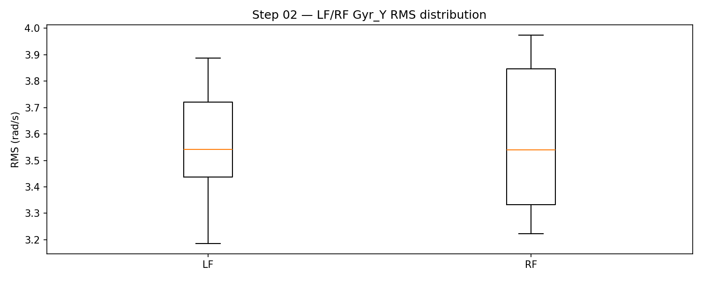
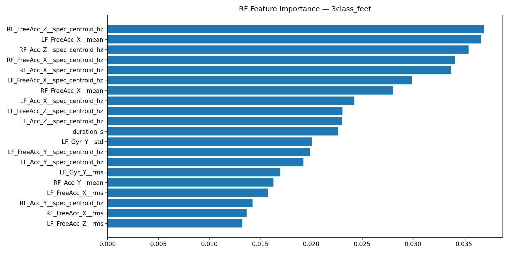

# BMED712 Track A Project 1 — Illustrated Report

## Overview
This document summarizes our initial progress toward robust gait phenotyping. It embeds key figures produced by the pipeline and baseline models, and links to numeric artifacts for reproducibility.

## Data and Methods
- Data root: `dataset/data` (healthy, neuro, ortho). Trials contain processed signals and metadata (events, u-turn boundaries).
- EDA: step-wise visualizations and simple features (steps per trial, LF/RF RMS).
- Baseline task: 3-class classification (Healthy / Neuro / Ortho) with subject-group 5-fold CV; sensor ablations (ALL, LF+RF, LF, RF, LB, HE).
- Artifacts: metrics JSON in `results/artifacts/metrics_*.json`.

## Exploratory Visualizations
- Gait events and phases (LF/RF)

  

- U-turn segment and LB angle

  

- Steps per trial (Top-10)

  

- LF/RF gyro-Y RMS distribution

  

## Classification Results (3-class)
- Confusion matrices (sensors = LF,RF)

  

- Confusion matrices (sensors = ALL)

  

- Sensor availability frontier (#IMUs vs balanced accuracy)

  

- RF feature importance (Top-20, sensors = LF,RF)

  

## Notes and Next Steps
- Metrics summary is recorded in `results/report.md` and `results/artifacts/metrics_*.json`.
- Next: add leave-one-group-out (subject/pathology/condition) suites to the main results tables; extend to 8-class; integrate explainability (IG/attention) into sensor selection.

---
To regenerate figures and artifacts:
- EDA + visuals: `python3 analysis/pipeline.py`
- Baselines + ablations: `python3 analysis/train_baseline.py`
