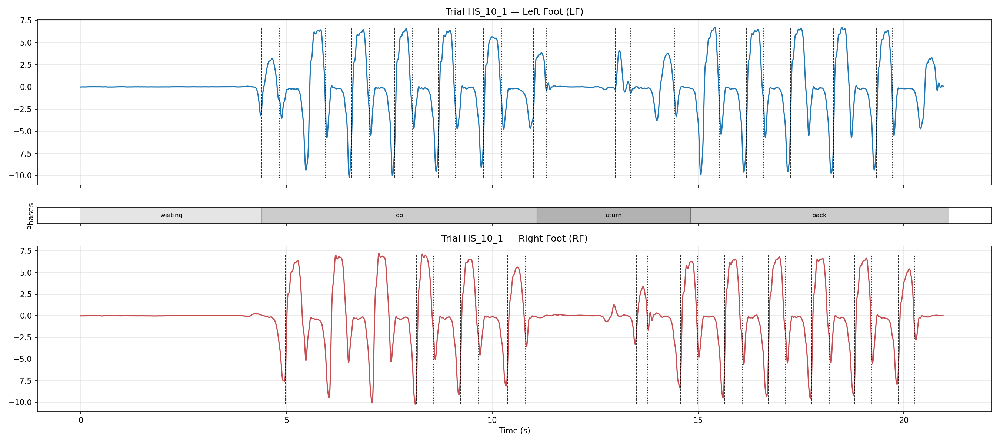
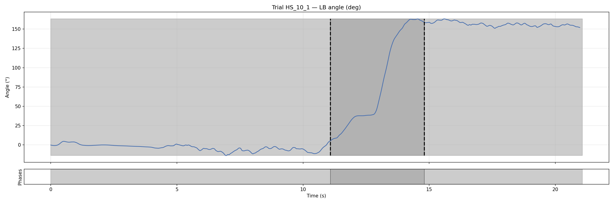
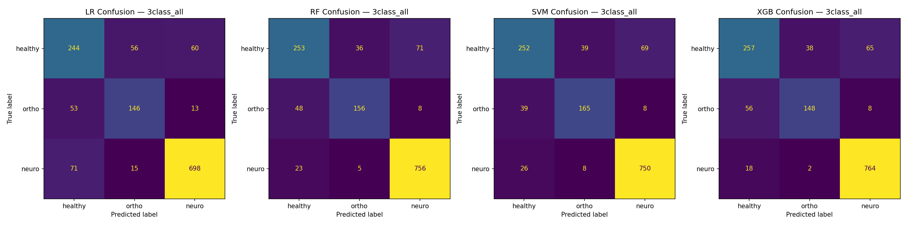
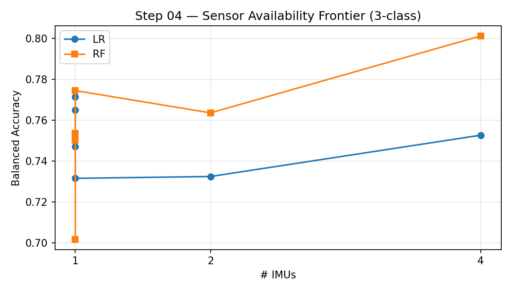
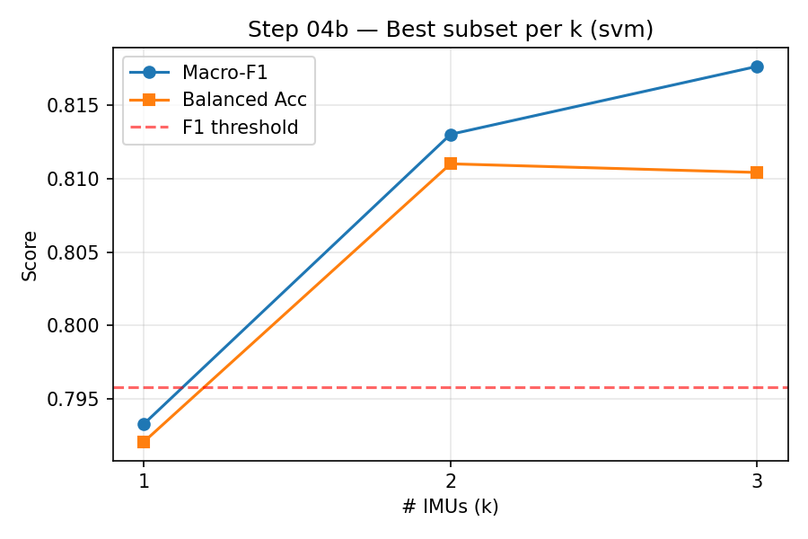
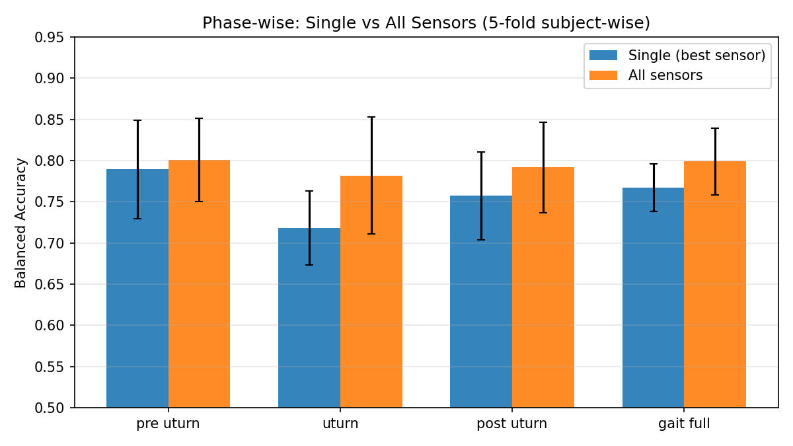
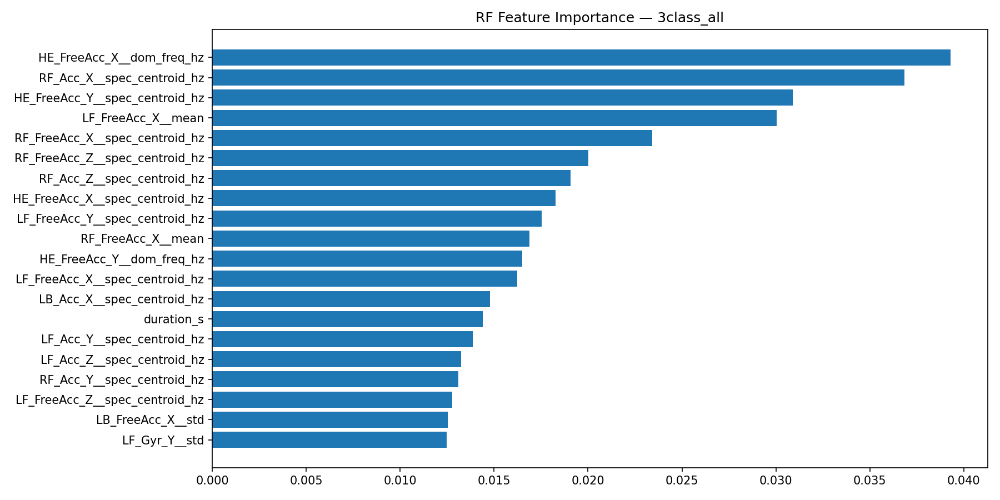
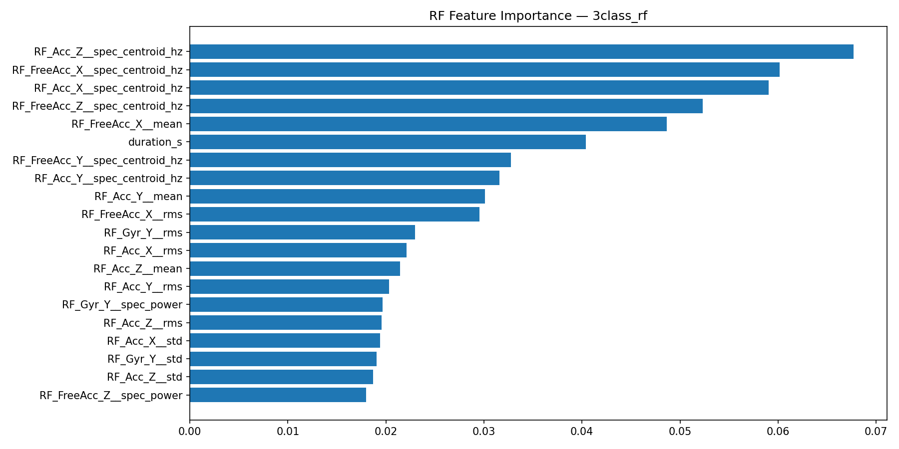

# BMED712 Track A – Robust Gait Phenotyping (IMU)

## Abstract
We evaluate lightweight, deployment-friendly classifiers (LR/RF/SVM/XGB) on a multi-IMU gait dataset for 3-class grouping (healthy/ortho/neuro), and systematically study sensor minimization (4→3→2→1). Under subject-wise 5-fold CV, SVM achieves the best full-sensor performance (Balanced Accuracy ≈ 0.809). Using exhaustive subset search with a ΔMacro-F1 ≤ 0.02 criterion, the recommended minimal configuration is a single IMU: Right Foot (RF), achieving Balanced Accuracy ≈ 0.811.

## Data & Structure
- Root: `dataset/data` organized as top-level (healthy/ortho/neuro) → cohort → subject → trial.
- Each trial contains `*_processed_data.txt` (sensor time series) and `*_meta.json` (metadata).

## Methods & Features
- Features: per-channel time features (mean, std, rms, ptp) and frequency features (dominant frequency, bandpower, spectral entropy) computed on the chosen segment (full gait or phase-specific).
- Models: Logistic Regression, Random Forest, SVM (RBF), XGBoost.

## Evaluation Setup
- Splits: StratifiedGroupKFold(5), grouped by subject to avoid leakage; preprocessing inside Pipelines.
- Metrics: Macro-F1 and Balanced Accuracy (5-fold mean ± std).

## EDA Examples

## Baseline Results (3-class, subject-wise CV)
| sensors | model | Macro-F1 (mean±std) | BAcc (mean±std) |
| --- | --- | --- | --- |
| all | LR | 0.748±0.051 | 0.753±0.055 |
| all | RF | 0.810±0.030 | 0.801±0.032 |
| all | SVM | 0.816±0.049 | 0.809±0.052 |
| all | XGB | 0.805±0.028 | 0.792±0.028 |
| feet | LR | 0.728±0.077 | 0.732±0.081 |
| feet | RF | 0.768±0.052 | 0.764±0.056 |
| feet | SVM | 0.793±0.053 | 0.792±0.060 |
| feet | XGB | 0.798±0.030 | 0.797±0.037 |
| he | LR | 0.722±0.051 | 0.732±0.058 |
| he | RF | 0.785±0.038 | 0.774±0.040 |
| he | SVM | 0.786±0.044 | 0.782±0.048 |
| he | XGB | 0.763±0.039 | 0.759±0.041 |
| lb | LR | 0.737±0.047 | 0.747±0.038 |
| lb | RF | 0.709±0.012 | 0.702±0.009 |
| lb | SVM | 0.758±0.043 | 0.763±0.037 |
| lb | XGB | 0.740±0.024 | 0.739±0.032 |
| lf | LR | 0.750±0.056 | 0.765±0.065 |
| lf | RF | 0.753±0.049 | 0.750±0.052 |
| lf | SVM | 0.761±0.057 | 0.769±0.061 |
| lf | XGB | 0.734±0.065 | 0.734±0.068 |
| rf | LR | 0.766±0.064 | 0.771±0.074 |
| rf | RF | 0.761±0.049 | 0.754±0.046 |
| rf | SVM | 0.793±0.041 | 0.792±0.044 |
| rf | XGB | 0.784±0.034 | 0.783±0.037 |

### Confusion Matrices (Full sensors vs Minimal RF)

## Sensor Availability & Minimization

| k | sensors | Macro-F1 | BAcc |
| --- | --- | --- | --- |
| full | HE,LB,LF,RF | 0.816 | 0.809 |
| 1.000 | RF | 0.793 | 0.792 |
| 2.000 | LB,RF | 0.813 | 0.811 |
| 3.000 | HE,LB,RF | 0.818 | 0.810 |
| recommended(2) | LB,RF | 0.813 | 0.811 |

## Phase-wise Single vs All Sensors

| phase | single_sensor | single_bacc | single_bacc_std | full_model | full_bacc | full_bacc_std |
| --- | --- | --- | --- | --- | --- | --- |
| pre_uturn | LF | 0.789 | 0.060 | SVM | 0.801 | 0.051 |
| uturn | HE | 0.718 | 0.045 | SVM | 0.782 | 0.071 |
| post_uturn | LF | 0.757 | 0.053 | RF | 0.792 | 0.055 |
| gait_full | HE | 0.767 | 0.029 | SVM | 0.799 | 0.040 |

## Window-based Results (subject-wise 5-fold)
| phase | sensor | win_s | overlap | model | bacc_mean | macro_f1_mean |
| --- | --- | --- | --- | --- | --- | --- |
| pre_uturn | RF | 1.000 | 0.500 | RF | 0.841 | 0.774 |
| pre_uturn | ALL | 1.000 | 0.500 | RF | 0.799 | 0.714 |
| pre_uturn | RF | 1.280 | 0.500 | SVM | 0.870 | 0.730 |
| pre_uturn | ALL | 1.280 | 0.500 | RF | 0.801 | 0.648 |
| pre_uturn | RF | 2.560 | 0.500 | SVM | 0.873 | 0.737 |
| pre_uturn | ALL | 2.560 | 0.500 | LR | 0.849 | 0.792 |
| uturn | RF | 1.000 | 0.500 | LR | 0.822 | 0.674 |
| uturn | ALL | 1.000 | 0.500 | RF | 0.797 | 0.661 |
| uturn | RF | 1.280 | 0.500 | LR | 0.709 | 0.570 |
| uturn | ALL | 1.280 | 0.500 | RF | 0.725 | 0.597 |
| uturn | RF | 2.560 | 0.500 | LR | 0.587 | 0.525 |
| uturn | ALL | 2.560 | 0.500 | RF | 0.578 | 0.494 |
| post_uturn | RF | 1.000 | 0.500 | SVM | 0.839 | 0.820 |
| post_uturn | ALL | 1.000 | 0.500 | RF | 0.812 | 0.795 |
| post_uturn | RF | 1.280 | 0.500 | SVM | 0.812 | 0.702 |
| post_uturn | ALL | 1.280 | 0.500 | RF | 0.747 | 0.714 |
| post_uturn | RF | 2.560 | 0.500 | LR | 0.831 | 0.782 |
| post_uturn | ALL | 2.560 | 0.500 | RF | 0.807 | 0.731 |
| gait_full | RF | 1.000 | 0.500 | SVM | 0.839 | 0.780 |
| gait_full | ALL | 1.000 | 0.500 | RF | 0.844 | 0.775 |
| gait_full | RF | 1.280 | 0.500 | SVM | 0.866 | 0.797 |
| gait_full | ALL | 1.280 | 0.500 | RF | 0.839 | 0.767 |
| gait_full | RF | 2.560 | 0.500 | SVM | 0.883 | 0.816 |
| gait_full | ALL | 2.560 | 0.500 | RF | 0.841 | 0.782 |

### Best Window (per phase, RF sensor)
- gait_full: best win ≈ 2.56s (BAcc≈0.883)
- post_uturn: best win ≈ 1.00s (BAcc≈0.839)
- pre_uturn: best win ≈ 2.56s (BAcc≈0.873)
- uturn: best win ≈ 1.00s (BAcc≈0.822)

## Feature Importance (RF as proxy)

## Phase-wise Single-Sensor Summary
| phase | sensor | n_trials | best_feature | best_score | mean_score | model | bacc_mean | acc_mean | macro_f1_mean | auc_macro_ovr_mean |
| --- | --- | --- | --- | --- | --- | --- | --- | --- | --- | --- |
| pre_uturn | LF | 1356.000 | LF_FreeAcc_X_entropy | 1.251 | 0.596 | SVM | 0.789 | 0.810 | 0.776 | 0.368 |
| uturn | HE | 1356.000 | HE_FreeAcc_Y_entropy | 1.411 | 0.467 | SVM | 0.718 | 0.759 | 0.703 | 0.331 |
| post_uturn | LF | 1356.000 | LF_FreeAcc_Y_entropy | 1.259 | 0.615 | SVM | 0.757 | 0.792 | 0.743 | 0.369 |
| gait_full | HE | 1356.000 | HE_FreeAcc_X_domfreq | 1.212 | 0.461 | RF | 0.767 | 0.848 | 0.782 | 0.382 |

### Best Sensor by Phase (effect-size proxy)
- pre_uturn: LF (best_feature=LF_FreeAcc_X_entropy, score=1.251)
- uturn: HE (best_feature=HE_FreeAcc_Y_entropy, score=1.411)
- post_uturn: LF (best_feature=LF_FreeAcc_Y_entropy, score=1.259)
- gait_full: HE (best_feature=HE_FreeAcc_X_domfreq, score=1.212)

### Best Single-Sensor CV Metrics (subject-wise 5-fold)
- pre_uturn: LF — model=SVM, BAcc=0.789, Acc=0.810, Macro-F1=0.776, AUC(macro-OvR)=0.368
- uturn: HE — model=SVM, BAcc=0.718, Acc=0.759, Macro-F1=0.703, AUC(macro-OvR)=0.331
- post_uturn: LF — model=SVM, BAcc=0.757, Acc=0.792, Macro-F1=0.743, AUC(macro-OvR)=0.369
- gait_full: HE — model=RF, BAcc=0.767, Acc=0.848, Macro-F1=0.782, AUC(macro-OvR)=0.382

## Discussion & Error Modes
- The single-IMU RF setup reduces Macro-F1 by ~0.006 vs full sensors while preserving Balanced Accuracy, indicating strong discriminative power in foot gyroscope channels.
- Misclassifications concentrate between ortho and healthy; RF-only may benefit from additional temporal/frequency descriptors in some gait variability conditions.

## Conclusion
1) Lightweight models achieve robust performance on the 3-class task; SVM full-sensor Balanced Accuracy ≈ 0.809.
2) With ΔMacro-F1 ≤ 0.02, a single-IMU (Right Foot, RF) is recommended; Balanced Accuracy ≈ 0.811, enabling practical deployment.
3) RF feature importance highlights strong contribution from foot gyroscope channels, supporting the minimal-IMU conclusion.

## Reproducibility
- python analysis/train_baseline.py
- python analysis/compile_reports.py