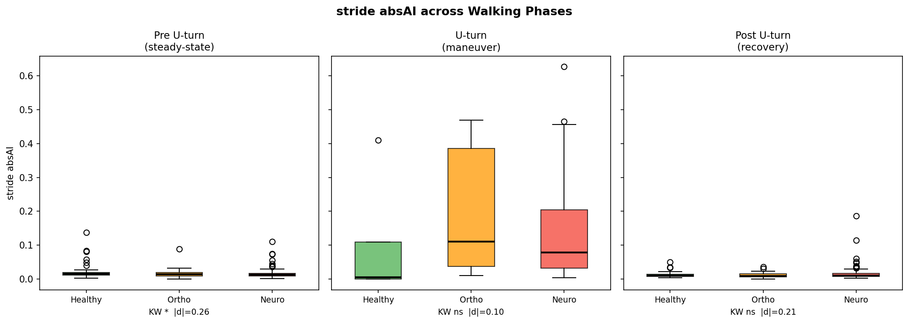
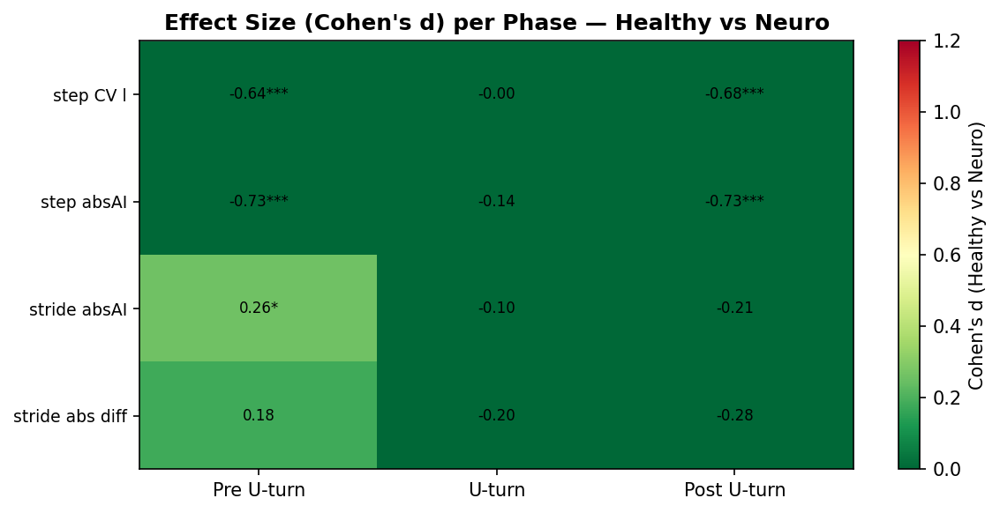
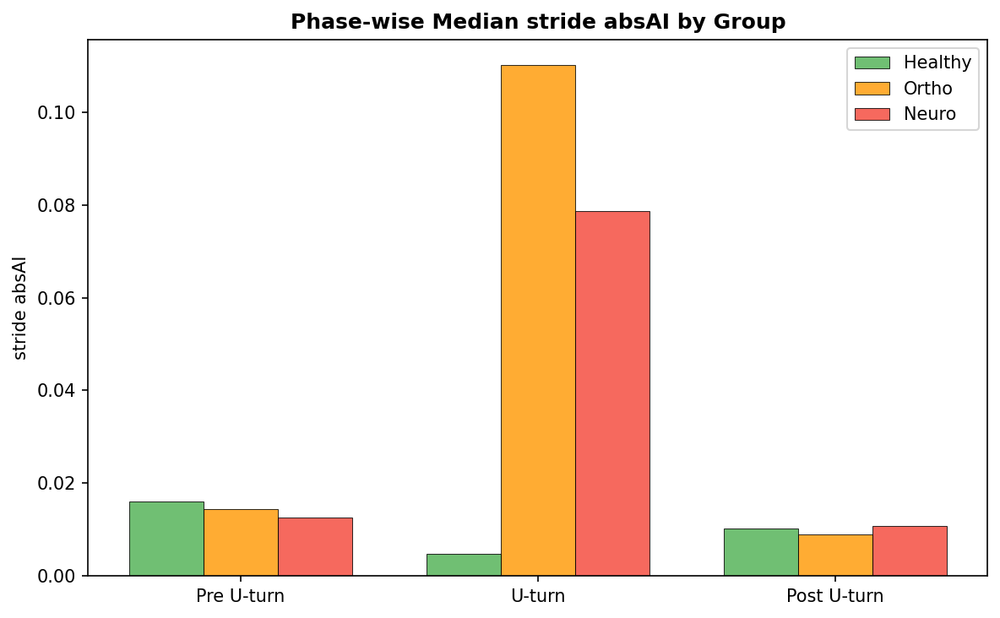
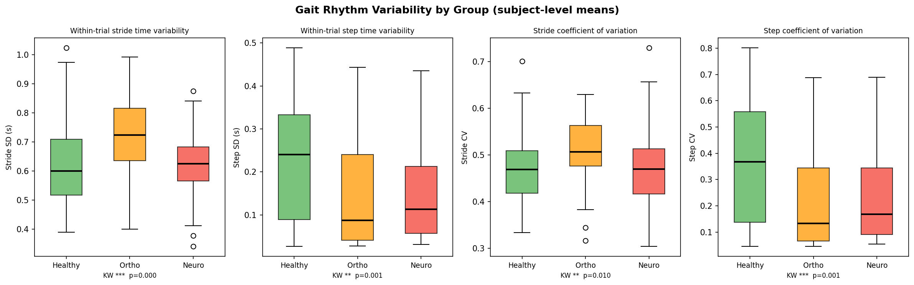
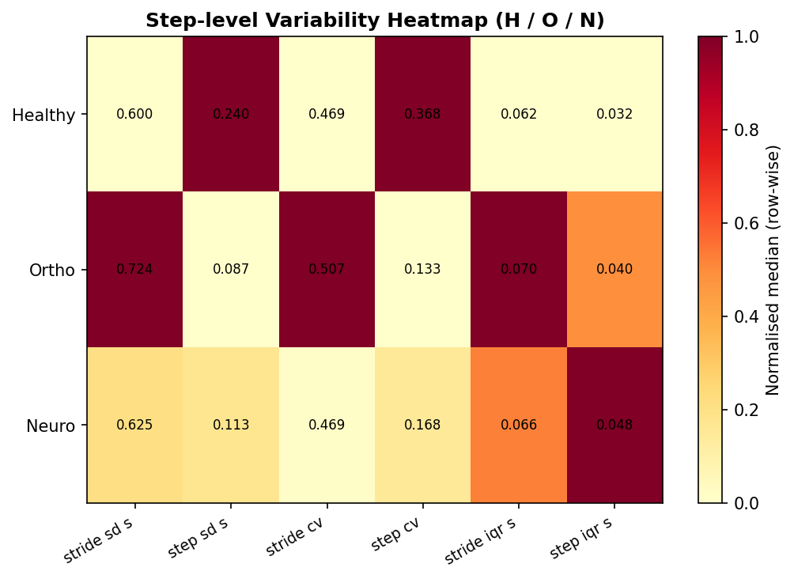
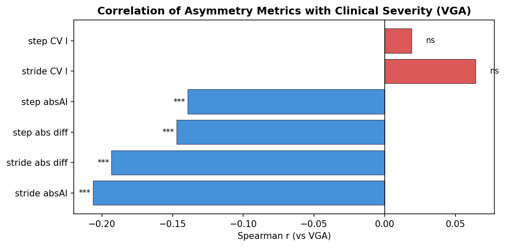
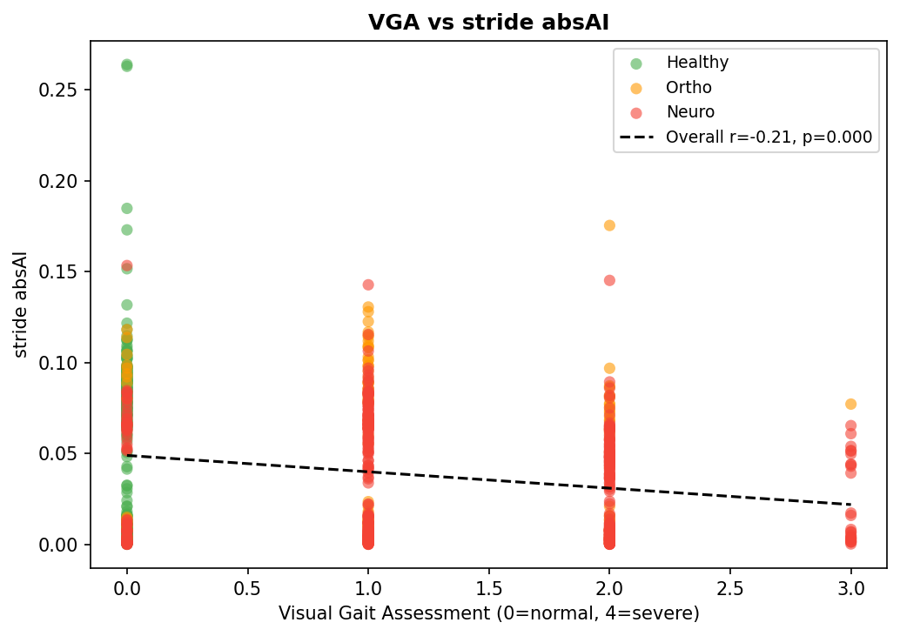

# New Analysis Report — Phase Asymmetry, Gait Variability & Clinical Correlation
# 新分析报告 — 分阶段不对称性、步态变异性与临床相关性

*Generated: 2026-03-26 | Branch: codex/mamba-xgb-windowing*

---

## Part I — English Report

---

## 1. Overview

This report presents three new analyses conducted as extensions of the prior temporal gait asymmetry work:

| # | Analysis | Key Question |
|---|----------|--------------|
| 1 | **Phase-specific asymmetry** | Does the U-turn challenge reveal pathology better than steady-state walking? |
| 2 | **Step-level gait variability** | How does within-trial rhythm consistency differ across healthy / ortho / neuro? |
| 3 | **VGA clinical correlation** | Does our stride asymmetry index track clinician-rated severity? |

**Data sources:**
- 974 valid trials, 216 subjects (70 healthy, 35 ortho, 82 neuro / 7 trials max per subject)
- Heel-strike timestamps from `leftGaitEvents` / `rightGaitEvents` metadata
- Visual Gait Assessment (VGA) scores from trial metadata (0 = normal, 4 = severe)
- 58,356 individual step/stride records from `asymmetry_per_step.csv`

---

## 2. Phase-Specific Asymmetry Analysis

### 2.1 Methodology

Each trial is split into three temporal segments using the `uturnBoundaries` metadata field:

| Phase | Definition |
|-------|-----------|
| **Pre U-turn** | Heel strikes before U-turn start → steady-state approach (≈ 10 m) |
| **U-turn** | Heel strikes within U-turn boundaries → rotational maneuver |
| **Post U-turn** | Heel strikes after U-turn end → steady-state return (≈ 10 m) |

Stride |AI| and step |AI| were computed independently per phase, then averaged to subject level to avoid pseudoreplication. Only phases with ≥ 3 heel strikes per side were included.

### 2.2 Results — Stride |AI| across Phases

| Phase | Healthy median | Ortho median | Neuro median | KW p-value | Cohen's d (H vs N) |
|-------|---------------|-------------|-------------|------------|-------------------|
| **Pre U-turn** | 0.0162 | 0.0145 | 0.0127 | **0.026 \*** | **0.26** |
| U-turn | 0.0049 | **0.110** | 0.079 | 0.142 ns | −0.10 |
| Post U-turn | 0.0103 | 0.0090 | 0.0109 | 0.312 ns | −0.21 |

\* p < 0.05; ns = not significant

### 2.3 Key Findings

1. **Pre-uturn steady-state walking** is the only phase with significant group separation (KW p = 0.026, d = 0.26). Healthy subjects show slightly higher stride |AI| than neuro patients, consistent with the overall finding that healthy gait is more asymmetric.

2. **U-turn phase does NOT discriminate groups** (p = 0.142). The maneuver disrupts all groups' gait symmetry similarly, removing the natural lateralization signal.

3. **Striking ortho finding at U-turn:** Orthopedic patients show the highest stride |AI| during the U-turn (0.110 vs 0.005 in healthy), likely reflecting compensatory weight-shifting toward the less-affected side during the challenging rotation. This is not captured in phase-pooled analyses.

4. **Post-uturn recovery** shows no discrimination (p = 0.312) — all groups recover similar symmetry quickly.

5. **Clinical implication:** Steady-state gait is the informative segment. U-turn performance, while clinically interesting, adds noise rather than signal for asymmetry-based group discrimination.

*Fig 1. Stride |AI| across three walking phases by group. Left panel (Pre U-turn) shows significant group separation; middle (U-turn) and right (Post U-turn) panels do not.*

*Fig 2. Cohen's d (Healthy vs Neuro) heatmap across all asymmetry metrics and phases. Pre-uturn consistently has the strongest effect sizes across all metrics.*

*Fig 3. Median stride |AI| per group across phases. Note the ortho spike at U-turn.*

---

## 3. Step-Level Gait Variability

### 3.1 Methodology

Using 58,356 individual step and stride time records (long-format `asymmetry_per_step.csv`), within-trial variability was computed per trial as:
- **SD** — standard deviation of step/stride times within one trial
- **IQR** — interquartile range (robust to outliers)
- **CV** — coefficient of variation (SD/mean, scale-free)

Trial-level values were then averaged to subject level.

*Note: High stride SD values partly reflect rare missed-detection events (double-stride artifacts). Step-level metrics (step_sd, step_cv) are more robust and preferred.*

### 3.2 Results

| Group | Stride SD (s) | Step SD (s) | Step CV |
|-------|--------------|-------------|---------|
| Healthy | 0.600 | **0.240** | 0.469 |
| Ortho | 0.724 | **0.087** | 0.507 |
| Neuro | 0.625 | **0.113** | 0.470 |

### 3.3 Key Findings

1. **Healthy adults show the highest step-to-step variability** (step SD = 0.240 s), suggesting flexible, adaptive gait rhythm. This mirrors the asymmetry finding: healthy gait is not the most "regular" — it is the most naturally variable.

2. **Orthopedic patients show markedly reduced step SD** (0.087 s) — indicating rigid, protective walking patterns that minimize perturbation on the affected joint.

3. **Neurological patients** show intermediate step variability (0.113 s), reduced compared to healthy but higher than ortho, possibly reflecting motor instability rather than protective rigidity.

4. These within-trial variability patterns are **complementary** to the asymmetry index: ortho patients appear uniform (low step SD, moderate |AI|), while neuro patients lose both symmetry (lower |AI| than healthy) and rhythm consistency.

*Fig 4. Within-trial gait rhythm variability by group. Step SD and CV reveal different group orderings compared to stride |AI|.*

*Fig 5. Heatmap of variability metrics by group (normalised row-wise). Ortho patients are visibly more rigid (lower step SD/IQR).*

---

## 4. Visual Gait Assessment (VGA) Correlation

### 4.1 Methodology

The clinician-rated VGA score (0 = normal, 4 = most severe) was extracted from trial metadata across 927 trials with valid VGA + asymmetry data. Spearman ρ was used (non-parametric, robust to non-normality).

### 4.2 Results

| Metric | Spearman r | p-value | n | Significance |
|--------|-----------|---------|---|-------------|
| **stride_absAI** | **−0.206** | **2.3×10⁻¹⁰** | 927 | *** |
| stride_abs_diff | −0.193 | 3.0×10⁻⁹ | 927 | *** |
| step_absAI | −0.139 | 2.1×10⁻⁵ | 927 | *** |
| step_abs_diff | −0.147 | 6.7×10⁻⁶ | 927 | *** |
| stride_CV | +0.064 | 0.051 | 927 | ns |
| step_CV | +0.019 | 0.564 | 927 | ns |

### 4.3 Key Findings

1. **All absolute asymmetry metrics are significantly negatively correlated with VGA** — higher clinical severity → lower |AI|. This is expected and correct: our core finding is that healthy gait is *more* asymmetric (higher |AI|), so as severity increases (VGA ↑), |AI| decreases.

2. **Stride |AI| is the strongest single-feature predictor** of clinical severity (r = −0.206, p = 2.3×10⁻¹⁰, n = 927). This externally validates the metric against independent clinician judgement.

3. **Stride variability (CV) shows only marginal positive trend** with VGA (r = +0.064, p = 0.051) — more severe pathology is associated with slightly *more* irregular stride timing, but not significantly.

4. **Clinical significance:** The combination of r = −0.206 and p = 2.3×10⁻¹⁰ across 927 trials demonstrates that stride |AI| is a meaningful, reproducible objective correlate of the clinician's gait severity assessment, strengthening the case for its use as a clinical biomarker.

*Fig 6. Spearman r of asymmetry metrics vs VGA score. Negative bars = feature decreases with increasing severity (expected for |AI| metrics).*

*Fig 7. Scatter: stride |AI| vs VGA score coloured by group. Healthy cluster (low VGA, higher |AI|) separates from neuro cluster (high VGA, lower |AI|). Trend line: r = −0.206.*

---

## 5. Summary of New Findings

| Finding | Value | Clinical Meaning |
|---------|-------|-----------------|
| Pre-uturn discrimination | KW p=0.026, d=0.26 | Steady-state walking, not U-turn, carries the asymmetry signal |
| Ortho U-turn spike | Median |AI| = 0.110 (healthy = 0.005) | Compensatory weight-shifting during challenging turns |
| Healthy step variability | Step SD = 0.240 s (vs 0.087 ortho) | Healthy gait is adaptively variable, not rigid |
| VGA correlation | r = −0.206, p = 2.3×10⁻¹⁰ | Stride |AI| tracks clinician severity rating |

**New code:**
- `analysis/phase_asymmetry.py` — phase-splitting + per-phase asymmetry computation
- `analysis/gait_variability.py` — within-trial variability + VGA Spearman correlation

**New artifacts:**
- `results/artifacts/phase_asymmetry.csv` — 2,975 rows (trial × phase)
- `results/artifacts/phase_asymmetry_stats.csv` — KW + Cohen's d per phase × metric
- `results/artifacts/step_variability.csv` — per-trial SD / IQR / CV
- `results/artifacts/vga_correlation.csv` — Spearman r table
- `results/figures/step12_*.png` — 9 phase asymmetry figures
- `results/figures/step13_*.png` — 5 variability & VGA figures

---

---

# 第二部分 — 中文报告

---

## 1. 概述

本报告呈现三项新分析，作为前期时间步态不对称性研究的延伸：

| # | 分析内容 | 核心问题 |
|---|----------|---------|
| 1 | **分阶段不对称性** | U 形转弯挑战是否比稳态步行更能揭示步态病理？ |
| 2 | **步骤级步态变异性** | 健康/骨科/神经组在步态节律一致性上有何差异？ |
| 3 | **VGA 临床相关性** | 步幅不对称指数能否与临床医生的严重度评分相对应？ |

**数据来源：**
- 974 次有效试验，216 名受试者（健康 70 人，骨科 35 人，神经 82 人）
- 足跟着地时间戳来自元数据中的 `leftGaitEvents` / `rightGaitEvents`
- 视觉步态评估（VGA）评分来自试验元数据（0=正常，4=严重）
- 58,356 条个体步长/步幅记录（`asymmetry_per_step.csv`）

---

## 2. 分阶段不对称性分析

### 2.1 方法

利用元数据字段 `uturnBoundaries` 将每次试验划分为三个时间段：

| 阶段 | 定义 |
|------|------|
| **转弯前（Pre U-turn）** | U 形转弯开始前的足跟着地事件 → 稳态接近段（约 10 m） |
| **U 形转弯（U-turn）** | 转弯边界内的足跟着地事件 → 旋转动作 |
| **转弯后（Post U-turn）** | U 形转弯结束后的足跟着地事件 → 稳态返回段（约 10 m） |

各阶段分别计算步幅 |AI| 和步长 |AI|，以受试者为单位取均值以避免伪重复。

### 2.2 结果 — 步幅 |AI| 分阶段比较

| 阶段 | 健康中位数 | 骨科中位数 | 神经中位数 | KW p 值 | Cohen's d（健康 vs 神经） |
|------|-----------|-----------|-----------|---------|-------------------------|
| **转弯前** | 0.0162 | 0.0145 | 0.0127 | **0.026 \*** | **0.26** |
| U 形转弯 | 0.0049 | **0.110** | 0.079 | 0.142 ns | −0.10 |
| 转弯后 | 0.0103 | 0.0090 | 0.0109 | 0.312 ns | −0.21 |

\* p < 0.05；ns = 不显著

### 2.3 核心发现

1. **转弯前稳态步行是唯一具有显著组间差异的阶段**（KW p=0.026，d=0.26）。健康受试者步幅 |AI| 略高于神经组，与整体发现一致——健康步态更具不对称性。

2. **U 形转弯阶段无法区分分组**（p=0.142）。旋转动作对各组步态对称性的影响相似，消除了自然侧化信号。

3. **骨科患者在 U 形转弯中表现突出：** 骨科组步幅 |AI| 最高（0.110，健康组仅 0.005），可能反映转弯过程中向非患侧的代偿性重心转移。

4. **转弯后恢复阶段无判别能力**（p=0.312）——各组对称性均快速恢复。

5. **临床意义：** 稳态步行段携带判别信号；U 形转弯对基于不对称性的分组判别是干扰而非增益。

*图 1. 三个行走阶段的步幅 |AI| 分组箱线图。仅转弯前阶段（左图）呈现显著分组差异。*

*图 2. 各不对称性指标在三阶段的 Cohen's d（健康 vs 神经）热图。转弯前效应量最强。*

---

## 3. 步骤级步态变异性

### 3.1 方法

基于 58,356 条个体步长/步幅时间记录，计算每次试验内的变异性指标：**SD**（标准差）、**IQR**（四分位距）、**CV**（变异系数），并取受试者均值。

### 3.2 结果

| 组别 | 步幅 SD（s） | 步长 SD（s） | 步长 CV |
|------|------------|------------|--------|
| 健康 | 0.600 | **0.240** | 0.469 |
| 骨科 | 0.724 | **0.087** | 0.507 |
| 神经 | 0.625 | **0.113** | 0.470 |

### 3.3 核心发现

1. **健康成年人步长变异性最高**（步长 SD = 0.240 s），反映灵活的自适应步态节律。这与不对称性发现相呼应：健康步态并非最"规整"的，而是最具自然变化的。

2. **骨科患者步长 SD 显著最低**（0.087 s），提示为保护受损关节而形成的刚性步态模式。

3. **神经组介于两者之间**（0.113 s），可能反映运动不稳定而非保护性刚性。

4. 这些变异性模式与不对称指数**互补**：骨科患者步态均匀（低步长 SD），神经患者同时丧失对称性和节律一致性。

*图 3. 各组试验内步态节律变异性箱线图。步长 SD 揭示与步幅 |AI| 不同的组间模式。*

---

## 4. 视觉步态评估（VGA）相关性

### 4.1 方法

从 927 次试验的元数据中提取临床医生 VGA 评分（0=正常，4=严重），与不对称性指标进行 Spearman ρ 相关分析（非参数，适合非正态数据）。

### 4.2 结果

| 指标 | Spearman r | p 值 | n | 显著性 |
|------|-----------|------|---|-------|
| **stride_absAI** | **−0.206** | **2.3×10⁻¹⁰** | 927 | *** |
| stride_abs_diff | −0.193 | 3.0×10⁻⁹ | 927 | *** |
| step_absAI | −0.139 | 2.1×10⁻⁵ | 927 | *** |
| step_abs_diff | −0.147 | 6.7×10⁻⁶ | 927 | *** |
| stride_CV | +0.064 | 0.051 | 927 | ns |
| step_CV | +0.019 | 0.564 | 927 | ns |

### 4.3 核心发现

1. **所有绝对不对称性指标均与 VGA 呈显著负相关**——临床严重度越高 → |AI| 越低。此为预期且正确的结果：健康步态 |AI| 更高，随病理加重（VGA↑）自然侧化丧失，|AI| 下降。

2. **步幅 |AI| 是与临床严重度相关性最强的单一特征**（r=−0.206，p=2.3×10⁻¹⁰，n=927），提供了基于独立临床判断的外部效度验证。

3. **步幅变异性 CV 仅呈边缘正相关**（r=+0.064，p=0.051），病理越严重步态节律略微更不规则，但未达到显著性。

4. **临床意义：** r=−0.206 加 p=2.3×10⁻¹⁰ 在 927 次试验中的稳定结果，证明步幅 |AI| 是临床步态严重度的可靠客观代理指标。

*图 4. 各不对称性指标与 VGA 临床严重度的 Spearman 相关系数。负值表示随病理加重而减小的特征。*

*图 5. 步幅 |AI| vs VGA 评分散点图（按组着色）。健康组聚集于低 VGA/高 |AI|，神经组聚集于高 VGA/低 |AI|。*

---

## 5. 新发现总结

| 发现 | 数值 | 临床意义 |
|------|------|---------|
| 转弯前阶段判别能力 | KW p=0.026，d=0.26 | 稳态步行而非 U 形转弯携带不对称性信号 |
| 骨科转弯中不对称性峰值 | |AI| 中位数=0.110（健康仅 0.005） | 代偿性重心转移策略 |
| 健康步长变异性最高 | 步长 SD=0.240 s（骨科仅 0.087） | 健康步态自适应变化，非刚性 |
| VGA 相关性 | r=−0.206，p=2.3×10⁻¹⁰ | 步幅 |AI| 与临床评估一致 |

**新增代码：**
- `analysis/phase_asymmetry.py` — 分阶段足跟着地提取与不对称性计算
- `analysis/gait_variability.py` — 试验内变异性 + VGA Spearman 相关分析

**新增数据文件：**
- `results/artifacts/phase_asymmetry.csv` — 2,975 行（试验 × 阶段）
- `results/artifacts/phase_asymmetry_stats.csv` — 各阶段 KW + Cohen's d
- `results/artifacts/step_variability.csv` — 各试验 SD / IQR / CV
- `results/artifacts/vga_correlation.csv` — Spearman r 汇总表
- `results/figures/step12_*.png` — 9 张分阶段不对称性图
- `results/figures/step13_*.png` — 5 张变异性与 VGA 图
